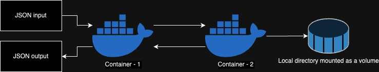

## Overview:

This project involves two containers operating within a microservice architecture to handle the calculation of product sums based on the data provided in a JSON input file. The first container serves as an orchestrator and gatekeeper, while the second container is responsible for performing the actual calculation based on the provided file.

## JSON Input and Output Specifications

### JSON Input Format:

```
{
   "file": "file.dat",
   "product": "wheat"
}
```

### JSON Output Format:

#### Successful Calculation:

```
{
   "file": "file.dat",
   "sum": 30
}
```


#### Errors:

```
{
   "file": "file.dat",
   "error": "Input file not in CSV format."
}
```

```
{
   "file": "file.dat",
   "error": "File not found."
}
```

```
{
   "file": null,
   "error": "Invalid JSON input."
}
```


## Workflow:



### Container 1 - Orchestrator and Gatekeeper

#### Actions:

* Listen for JSON Input: 

    Receives JSON input via an HTTP POST request to the exposed port 6000 on the /calculate endpoint.

* Input Validation: 

    Validates the input JSON, ensuring a file name is provided. If the "file" parameter is null, it returns an "Invalid JSON input" error.
    Verifies the existence of the specified file. If the file doesn't exist, it returns a "File not found" error.

* Communication with Container 2: 

    Sends the "file" and "product" parameters to Container 2 for the product sum calculation.
    Forwards the request and receives the response from Container 2.

### Container 2 - Calculation Container

#### Actions:

* Setup:
   
    Mounts the host machine directory to a docker volume.

* Listen for Requests:
   
    Listens on an endpoint/port defined within the Docker network to respond to calculate requests.

* Calculation Process:
   
    Loads the specified file into memory.
    Parses the CSV file using the chosen CSV library within the container.
    Calculates the sum of all rows matching the given "product" parameter.

* Return Response:
  
    Returns the sum in the appropriate JSON format or an error message indicating if the file is not a proper CSV file.

## Running the System

1. Copy the test file `file.dat` of the following format in the root folder of this repository:
```
product,amount
wheat,10
wheat,20
oats,5
barley,6
```
2. Run `docker-compose up` in the directory

3. Make sure for both the containers are running and performing following:

    #### Container 1:

    Listens on port 6000 for incoming JSON input. Ensure it's running and exposed to receive requests.

    #### Container 2:

    Listens on a defined endpoint within the Docker network for processing calculation requests. Ensure it's configured to handle file processing based on the received "file" and "product" parameters.

4. Perform following test:
   
   - HTTP POST an *invalid JSON* input to `http://localhost:6000/calculate` and verify that you return the invalid JSON input response in your JSON response
   - HTTP POST a *valid JSON* input to `http://localhost:6000/calculate` and verify that you return the correct sum in your JSON response
   - HTTP POST a *valid JSON* input with a file name that does not exist in the mounted volume and verify that you return the file not found JSON response
   - HTTP POST a *valid JSON* input with a file that contains data not in the correct CSV format and verify that you return the input file not in correct format response

5. Run `docker-compose down -v --rmi all` to shut running containers down and remove their docker images